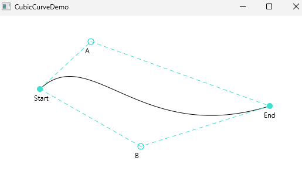

# fopt



Lösungen zu Aufgaben und Implementierung der Übungen des Moduls [**fopt**](https://www.hochschule-trier.de/informatik/fernstudium/module/a-h/fopt) im WS 2023/2024 im Fernstudiengang Informatik (M.C.Sc.) der [Hochschule Trier](https://www.hochschule-trier.de/).


## Verfügbare Packages
Die Lösungen zu den Aufgaben sind in Packages aufgeteilt.

### oop.counter
Implementierung der ASB Testaufgabe.

### pp.ampel
ASB-Aufgabe zu FOPT 1.

### pp.synchstacksem
ASB-Aufgabe zu FOPT 2.

### gui
ASB-Aufgabe zu FOPT 3 und 4.

## da.tasks.rmi.central
ASB-Aufgabe zu FOPT 5.

### fopt1.*
Implementierung der Übungen aus dem Script **FOPT 1**.


### fopt2.*
Implementierung der Übungen aus dem Script **FOPT 2**.


### fopt3.*

Implementierung der Übungen aus dem Script **FOPT 3**.

### fopt4.*

Implementierung der Übungen aus dem Script **FOPT 4**.

### fopt5.*

Implementierung der Übungen aus dem Script **FOPT 5**.

### ee
Verzeichnis enthält die Übungen zu den Servlets aus **FOPT6**.

### fopt6jsf
Verzeichnis enthält die Übungen zu den Java Server Faces aus **FOPT6**.


## javafx intellij settings

Die folgenden VM-Optionen sollten zu der Build and run-configuration für javafx-Implementierungen hinzugefügt werden:

``` bash
--module-path
"C:\javafx-sdk-21.0.1\lib"
--add-modules
javafx.controls,javafx.fxml
```

Der Modul-Pfad ist entsprechend dem tatsächlichen Zielverzeichnis anzupassen.
